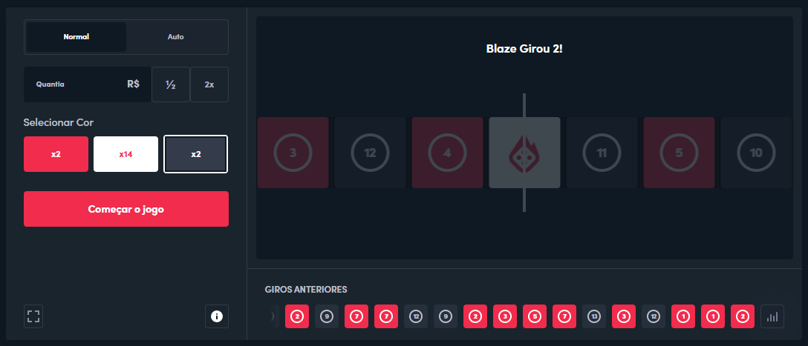

# Desafio Frontend: Clone da Interface do Game Double da Blaze

## Descrição

O desafio é simples e divertido: **clonar a interface** do game "Double" da Blaze, conforme a imagem abaixo. Seu objetivo é replicar o layout e o design o mais próximo possível do original. A única funcionalidade que precisa estar implementada é a **animação** do giro dos "tiles".

## Objetivo

- Reproduzir a interface do game "Double" da Blaze.
- Implementar a animação do giro das "cartas" (não é necessário implementar a lógica do jogo, apenas a animação).

## Requisitos

- Usar **Vue.js**, **Typescript** e o **[Quasar](https://quasar.dev/)**.
- A interface deve ser responsiva e funcionar bem em diferentes tamanhos de tela.
- A animação deve ser fluida e similar à original.

## Entrega

o prazo de entrega é de 1 semana! 

1. Envie o seu codigo compactado e anexado em um email para:
kyotodevindie@gmail.com

## Imagem de Referência

Aqui está a imagem que você deve utilizar como referência para o design da interface:

[Visite o site oficial da Blaze para ver o jogo Double](https://blaze.ac/pt/games/double)

## Dicas

- Foque na parte visual e na animação.
- Use sua criatividade para replicar a experiência da melhor forma possível.

Boa sorte! Estamos ansiosos para ver o que você vai criar!
